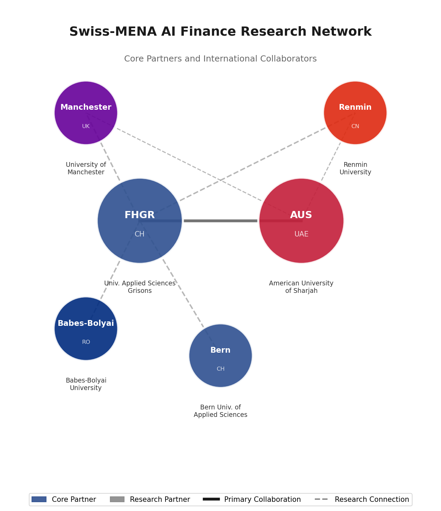
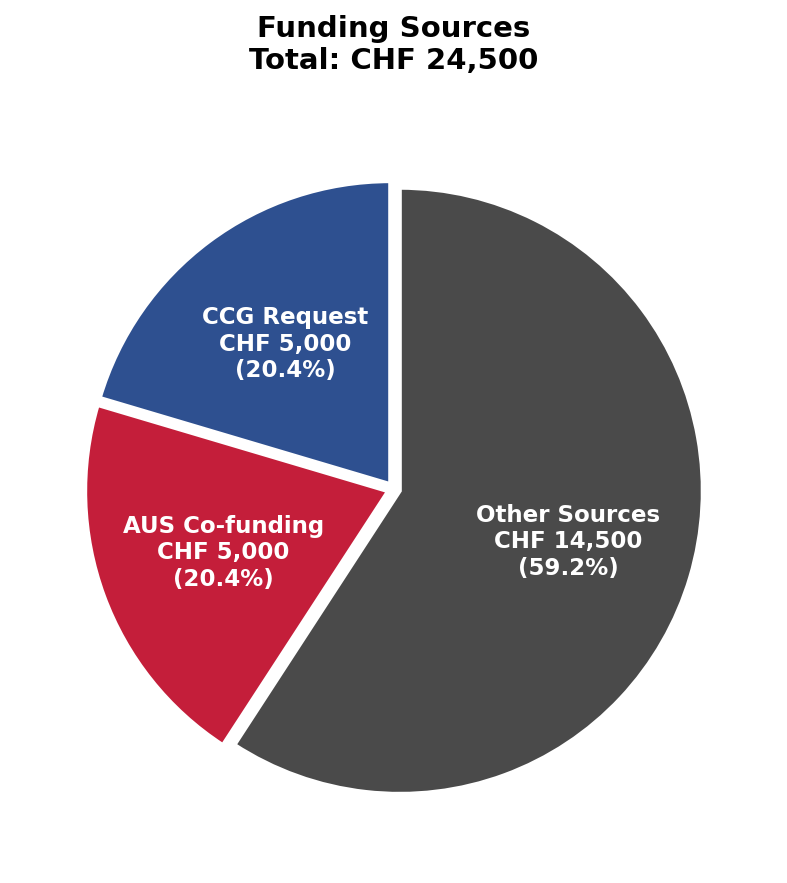

# AI for Digital Finance

## Launching the Swiss-MENA Research Network

**International Workshop | April 21-23, 2026 | American University of Sharjah, UAE**

---

## At a Glance

| | |
|---|---|
| **7 Years** | of research collaboration |
| **550+** | citations on joint publications |
| **6** | partner institutions |
| **5** | countries represented |
| **CHF 24,500** | total project budget |

---

## The Vision

The Swiss-MENA AI Finance Research Network represents a transformative initiative to establish sustainable collaboration between two of the world's most dynamic financial innovation ecosystems.

This workshop marks the formal launch of an international research network dedicated to advancing AI applications in financial services, bringing together leading academics, industry practitioners, and policymakers from Switzerland and the MENA region.

---

## Quick Navigation

### Research & Publications
- **[Research Portfolio](Research.md)** - 7 joint publications, 550+ citations, research areas
- **[Network Map](Network-Map.md)** - Partner institutions and collaboration network
- **[Collaboration Story](Collaboration-Story.md)** - 7-year journey and testimonials

### Workshop Details
- **[Workshop Program](Workshop-Content.md)** - Full 3-day agenda and sessions
- **[Timeline](Timeline.md)** - Project milestones and Gantt chart
- **[Budget](Budget.md)** - Detailed budget breakdown and funding sources

### Application
- **[Application Materials](Application-Materials.md)** - CCG application summary

---

## Key Highlights

### Research Excellence

Our collaboration has produced foundational research in cryptocurrency markets and blockchain security:

| Publication | Year | Citations |
|-------------|------|-----------|
| GARCH Modelling of Cryptocurrencies | 2017 | **329** |
| A Statistical Analysis of Cryptocurrencies | 2017 | **179** |
| Blockchain Security & Fraud Detection | 2024 | 4 |

[View all publications](Research.md)

---

### International Network

**Core Partners:**
- FHGR (Switzerland) - Network Coordinator
- AUS (UAE) - MENA Coordinator

**Research Partners:**
- University of Manchester (UK)
- Renmin University (China)
- Babes-Bolyai University (Romania)
- Bern University of Applied Sciences (Switzerland)

[View network details](Network-Map.md)

---

### Workshop Program

**Day 1: Research Frontiers**
- Keynote: LLMs in Financial Services
- Research sessions on AI methods and blockchain security
- Welcome reception

**Day 2: Industry Applications**
- Keynote: Digital Transformation in Gulf Banking
- Explainable AI for regulatory compliance
- Industry roundtable

**Day 3: Network Launch**
- MSCA doctoral training workshop
- Working group formation
- **MoU signing ceremony**

[View full program](Workshop-Content.md)

---

### Budget Overview

| Source | Amount | Share |
|--------|--------|-------|
| CCG Request | CHF 5,000 | 20% |
| AUS Co-funding | CHF 5,000 | 20% |
| Other Sources | CHF 14,500 | 60% |
| **Total** | **CHF 24,500** | 100% |

[View detailed budget](Budget.md)

---

## Organizers

### Prof. Dr. Joerg Osterrieder
**University of Applied Sciences of the Grisons (FHGR), Switzerland**

Network Coordinator | Financial ML, Risk Management, Blockchain

Email: joerg.osterrieder@fhgr.ch

### Prof. Dr. Stephen Chan
**American University of Sharjah (AUS), UAE**

MENA Coordinator | Statistical Finance, Cryptocurrency Markets

Email: schan@aus.edu

---

## Supported By

**Leading House for the Middle East and North Africa (LHMENA)**

Connect & Collaborate Grant Program

HES-SO, Switzerland

---

## Join Us

The Swiss-MENA AI Finance Research Network welcomes collaborators from academic institutions and industry partners interested in advancing AI applications in financial services.

**Workshop Registration**: April 2026

**Network Membership**: Contact coordinators

---

*Documentation generated: November 2024*

*Publication data source: [OpenAlex](https://openalex.org)*
